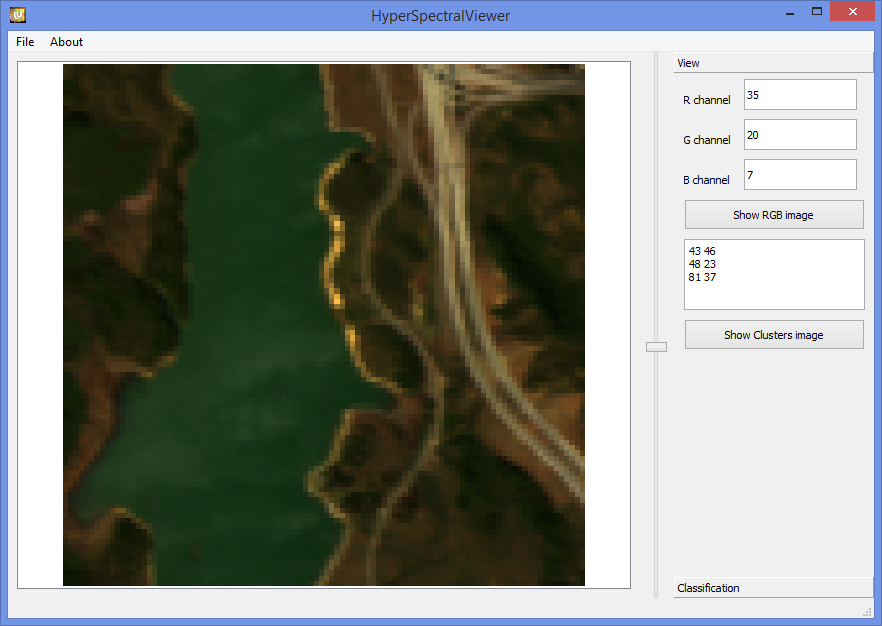

# HyperSpectralProject

Репозиторий документации и программного обеспечения для классификации и визуализации гиперспектральных изображений.

# Распознавание сигнатур

 ПО для распознавания сигнатур гиперспектрального изображения корреляционно экстремальными методами сравнения их с эталонами на основе вычисления оценок сходства инвариантных к заданным преобразованиям ([zip архив](hsi_recognition/1-2_HSI-Recognition.zip)).
 
 Вычисление параметров эмпирических мод сигнатур гиперспектральных изображений ([zip архив](hsi_recognition/4-6_EmpiricalModes.zip)).

# ГИС Терра Plus

 Руководство пользователя ГИС Терра Plus ([pdf](terra_plus/ГИС_Терра_Plus_руководство_пользователя.pdf))
 
 Руководство программиста ГИС Терра Plus ([pdf](terra_plus/ГИС_Терра_Plus_руководство_программиста.pdf))
 
 Руководство программиста ГИС Терра (архив) ([pdf](terra_plus/ГИС_Терра_Plus_руководство_программиста.pdf))

# Python HSI Application

Программное обеспечение реализовано на языке Python 3 и является кроссплатформенным



## Установка зависимостей

Для установки зависимостей программы необходимо установить библиотеки Pytnon3 и библиотеки, перечисленные в файле `requirements.txt`.

```bash
cd <project_folder>/sources
pip install -r requirements.txt
```

## Запуск программы 

Для запуска программы запустите файл `app.py`.

```bash
cd <project_folder>/sources
python app.py
```

Если вы ходите, чтобы по умолчанию открылись предзагруженные данные, запустите программу с параметром `-i`.

```bash
python app.py -i ..\data\F224.hdr
```


 
